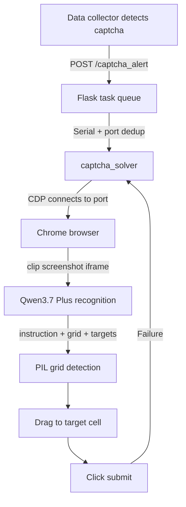

Shejiu includes a fully automated captcha-solving system that requires no human intervention. It uses Chrome DevTools Protocol (CDP) to take direct control of the browser and Qwen3.7 Plus — served through Alibaba Cloud Model-as-a-Service (Bailian MaaS) — to recognize and solve image-based captchas. When your data collection process encounters a captcha, the system detects it, routes it through a task queue, and resolves it end-to-end in approximately 40 seconds.

## How It Works

When the data collector detects a captcha, it triggers a serial pipeline that handles recognition and interaction automatically:

1. The data collector detects a captcha and sends a `POST /captcha_alert` request to the Flask task queue.
2. The queue processes tasks serially and deduplicates requests by port, so multiple alerts for the same browser instance do not create duplicate jobs.
3. The captcha solver connects to the target Chrome instance via CDP on the configured port.
4. It captures a region screenshot of the captcha iframe using bounding box clipping (see [Known Limitations](#known-limitations) for why full-frame access is not used).
5. Qwen3.7 Plus receives the full image and returns a structured response: `{instruction, grid, targets}`.
6. PIL grid detection uses the returned grid to calculate the pixel coordinates of each cell.
7. The solver drags to the target cell identified in `targets`.
8. The solver clicks submit. If verification fails, the pipeline retries from step 3.



## Port Configuration

The solver connects to Chrome instances using a fixed port-mapping scheme. You configure the base ports once; the solver derives the final port from the `browser_index` at runtime.

```python captcha_config.py
# Baiying browser: base port 9340 + browser_index
# Taobao browser:  fixed port 9335
# Local proxy bridge: base port 9801 + browser_index
BUYIN_BROWSER_PORT = 9340
```

Each browser index maps to exactly one CDP port. The task queue deduplicates incoming alerts against this port, so you will never have two solver jobs contending for the same browser.

## AI Recognition

Captcha image analysis is handled by Qwen3.7 Plus through the Alibaba Cloud Bailian MaaS endpoint. The solver makes a single full-image recognition call per captcha attempt — there are no intermediate crops or pre-filtering steps.

**What the model returns:**

| Field | Description |
|---|---|
| `instruction` | Human-readable task description extracted from the captcha |
| `grid` | Detected 3×3 grid boundary coordinates |
| `targets` | Cell index or indices the user must select |

**Cost and latency at a glance:**

| Metric | Value |
|---|---|
| Average latency | ~6.4 seconds per call |
| Average cost | ~¥0.007 per call |

```python recognition.py
from openai import OpenAI

# Qwen3.7 Plus via Alibaba Cloud Bailian MaaS
# Single full-image recognition — returns {instruction, grid, targets}
# Avg latency: 6.4s | Avg cost: ¥0.007/call
```

## Time Budget

The captcha pipeline is designed to complete well within the captcha's validity window. The approximate time breakdown for a single end-to-end solve is:

| Step | Time |
|---|---|
| Screenshot capture | ~2s |
| AI recognition (Qwen3.7 Plus) | ~6s |
| Cell drag | ~20s |
| Submit + verification | ~10s |
| **Total** | **~40s** |

<Warning>
  Captchas expire after approximately **2 minutes**. The full pipeline — from detection through successful verification — must complete within **1 minute** to leave a safe margin. If your infrastructure is under heavy load and response times increase, monitor solver completion latency proactively.
</Warning>

## Known Limitations

<AccordionGroup>
  <Accordion title="Cross-origin iframes" icon="bug">
    Captcha iframes served from `rmc.bytedance.com` are cross-origin and cannot be accessed via Playwright `page.frames()`. Attempts to use `element.screenshot()` on the iframe also time out due to visibility checks.

    **Solution:** The solver retrieves the iframe's `bounding_box()` and calls `page.screenshot(clip=bbox)` to capture a clipped region screenshot instead. You do not need to configure anything — this approach is the default.
  </Accordion>

  <Accordion title="Jigsaw/slider captchas not supported" icon="puzzle-piece">
    The "press and hold to drag and complete the jigsaw" slider captcha type is **not yet automated**. When the solver encounters this captcha variant, it recognizes the failure and escalates to manual handling.

    OpenCV gap-detection logic exists in the legacy `auto_verify.py` but has not yet been migrated to the current pipeline.
  </Accordion>

  <Accordion title="Grid detection interference" icon="grip">
    Window title underlines and the dashed border edges of the "drag here" drop zone can introduce spurious lines that interfere with 3×3 grid detection.

    **Solution:** The solver requires at least 3 of 4 candidate grid lines to match real detected lines (tolerating at most 1 inferred line). This threshold filters out decorative UI lines without sacrificing grid accuracy.
  </Accordion>
</AccordionGroup>

## Operational Rules

Follow these three rules without exception. Each one reflects a real failure mode discovered in production.

<Warning>
  **Rule 1 — Fully retire old API endpoints and state when switching architectures.**

  Leaving stale `/start_verify` routes in place while deploying new verification logic caused monitoring dashboard errors (`参数错误 [500][501]`). When you introduce a new architecture, delete the old endpoints entirely — do not leave them as dead code.
</Warning>

<Warning>
  **Rule 2 — Always restart the Flask service after any code change.**

  Python's module cache means the running process will continue executing the old version of your code even after you save changes to disk. Restart the Flask service every time you modify solver logic, configuration, or route handlers.
</Warning>

<Warning>
  **Rule 3 — The captcha is valid for approximately 2 minutes. The full pipeline must complete in under 1 minute.**

  Budget: screenshot (~2s) + AI recognition (~6s) + drag (~20s) + submit (~10s) ≈ 40s total. Any queuing delay or retry adds to this. If the captcha expires mid-solve, the next retry starts a fresh captcha — not a resume of the previous one.
</Warning>
